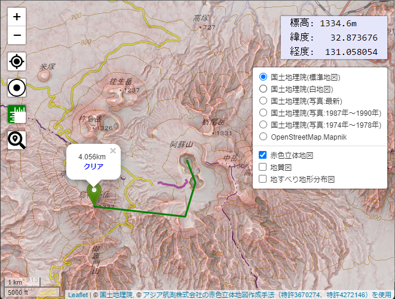
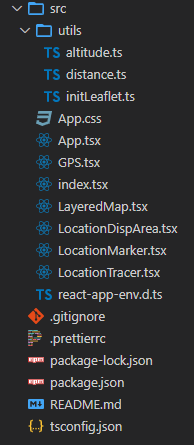
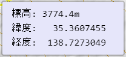
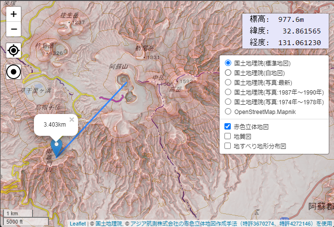
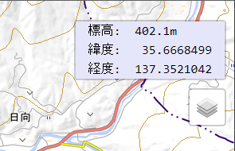
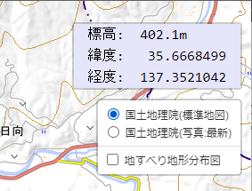
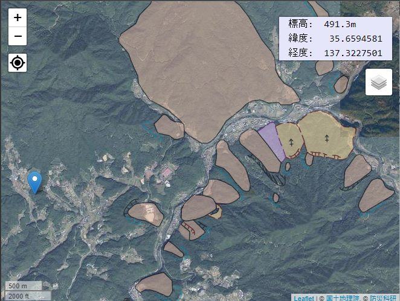
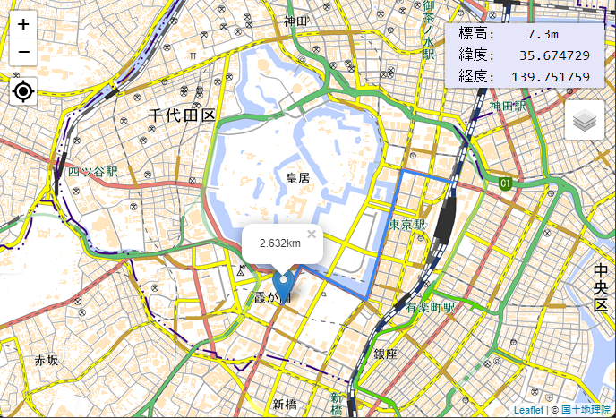
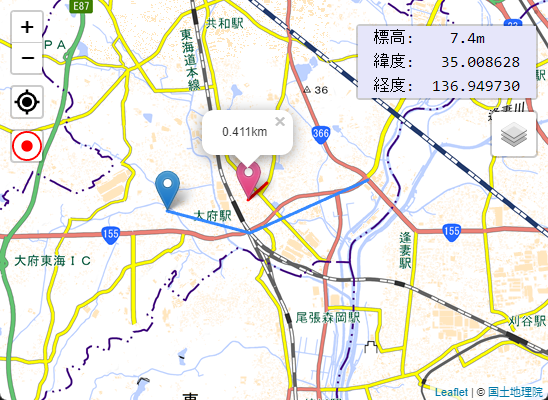

# React-Leafletで作る標高表示機能付きマップ

動作確認ページ：
https://murasuke.github.io/leaflet-altitude-map/

ソース：
https://github.com/murasuke/leaflet-altitude-map

完成イメージ




## はじめに

地図アプリを作成するにあたり、Google Maps APIが有料(無料枠はあるが、カード登録が必要)だったため
無料で使える`国土地理院のデータ`＋[leafletjs](https://leafletjs.com/)の組み合わせを試してみることにしました。

* 国土地理院のデータは、リアルタイムに地図を表示するプログラムであれば、出展の明示のみで利用可能なようです。

ただ地図を表示するだけではつまらないため、いくつか機能を追加します。
1. 地図の切り替え、オーバーレイ表示
2. クリックした地点の標高を表示する
3. 距離計測機能
4. GPSから取得した位置情報から移動距離を求める
5. URL(QueryString)に位置や表示している地図の状態を保持し同期する(ブックマークや、戻る、進むを可能とする)

[地図の利用手続パンフレット](https://www.gsi.go.jp/common/000223838.pdf)より抜粋
```
●国土地理院サーバー上の地理院タイルをリアルタイムで読み込み表示するウェブサイト等を作成する場合、
申請は必要ですか？
➡ リアルタイムでの読込みは、出典の明示のみで申請不要です。出典は、「国土地理院」、「地理院タイル」等と記載してい
ただき、地理院タイル一覧ページ（https://maps.gsi.go.jp/development/ichiran.html）へのリンクを付けてください。
```

一度に実装するのは大変なので7段階に分けて実装しようと思います

  * ①[React Leaflet](https://react-leaflet.js.org/)を利用して最低限の地図アプリを作成する
  * ②クリックした場所の標高を表示する機能を追加する
  * ③初期表示位置を現在の位置に変更する
  * ④GPSアイコンを追加して現在位置に戻せるようにする
  * ⑤マップの切り替えとオーバーレイ
  * ⑥マーカーをドラッグして距離を計測する
  * ⑦タイマーで位置を記録し、移動距離を表示する
  （スマホで画面を暗くならないように制御する）


---
### ※参考
### 国土地理院の解説ページ

国土地理院のサイトで[標高を求めるプログラム](https://maps.gsi.go.jp/development/elevation.html)が公開されています。JQueryを使っているため、そのままではReactで利用ができませんが、改修すれば何とかなりそうです。

* [標高を求めるプログラム](https://maps.gsi.go.jp/development/elevation.html)
* [標高タイルの詳細仕様](https://maps.gsi.go.jp/development/demtile.html)

### 標高の求め方について

  * 入力した経緯度値から、その場所に該当する「標高タイル」（PNG形式）をクライアントにダウンロード
  * 入力した経緯度値に該当する「標高タイル」のピクセルの画素値（RGB値）から、標高値が算出する

    ※ 詳細は元のソースでご確認ください。
---

## 前提

* React、TypeScript、npmの基本的な機能を理解していること

## アプリケーションの作成準備

### React-Leaflet のインストール

create-react-appでアプリのテンプレートを作成し、leafletをインストールします。

```
$ npx create-react-app leaflet-altitude-map --template typescript --use-npm
$ cd leaflet-altitude-map
$ npm i leaflet react-leaflet
$ npm i -D @types/leaflet
```

* 完成後は下記のような構成になります




## ①[React Leaflet](https://react-leaflet.js.org/)を利用して最低限の地図アプリを作成する

* 地図とマーカーを表示します
* ドラッグ＆ドロップによる移動や、マウスホイールによる拡大縮小もできます


### ①-1位置を表すアイコン(Marker)の読み込み

React-leafletの不具合？でアイコンが読み込まれないため、最初にアイコンを読み込む処理を作ります

src/utils/initLeaflet.ts

```tsx
import Leaflet from 'leaflet';
import icon from 'leaflet/dist/images/marker-icon.png';
import iconShadow from 'leaflet/dist/images/marker-shadow.png';

// marker setting
let DefaultIcon = Leaflet.icon({
  iconUrl: icon,
  shadowUrl: iconShadow,
  iconAnchor: [12, 41], // アイコンのとがった位置をクリックした場所に合わせるためのオフセット
  popupAnchor: [0, -32], // ポップアップの位置も合わせて調整
});
Leaflet.Marker.prototype.options.icon = DefaultIcon;

```

### ①-2マップ表示機能ソース

* [react-leaflet](https://react-leaflet.js.org/)で地図を表示します
* `leaflet/dist/leaflet.css`を読み込みます(忘れると表示が崩れます)
* `①-1`で作成したソースを読み込み、位置表示アイコンをロードします
* 国土地理院の地図タイルを`<TileLayer>`で読み込みます
* 位置表示アイコンを`<Marker>`で表示します


src/App.tsx

```tsx
import React, { VFC } from 'react';
import { MapContainer, TileLayer, Marker, Popup } from 'react-leaflet';
import { LatLng } from 'leaflet';
import 'utils/initLeaflet';
import 'leaflet/dist/leaflet.css';
import './App.css';

const App: VFC = () => {
  const position = new LatLng(35.3607411, 138.727262);  // 富士山頂

  return (
    <div className="App">
      <MapContainer center={position} zoom={13}>
        <TileLayer
          attribution='&copy; <a href="https://maps.gsi.go.jp/development/ichiran.html">国土地理院</a>'
          url="https://cyberjapandata.gsi.go.jp/xyz/std/{z}/{x}/{y}.png"
        />
        <Marker position={position}>
          <Popup>
            A pretty CSS3 popup. <br /> Easily customizable.
          </Popup>
        </Marker>
      </MapContainer>
    </div>
  );
};

export default App;
```

### ①-3マップを全画面表示するためにCSSを変更

App.css

```css
/* 地図を画面全体に表示 */
.leaflet-container {
  width: 100vw;
  height: 100vh;
}

/* カーソルを標準に戻す(標準の手アイコンは正確に位置指定ができない) */
.leaflet-grab {cursor: auto;}
```

### ①-4ブラウザで表示して動作を確認

```bash
npm run start
```
---

## ②クリックした場所の標高を表示する機能を追加する

* クリックした場所の標高と位置を表示します


### ②-1位置から標高を取得する機能を追加

国土地理院で公開されているソース[標高を求めるプログラム](https://maps.gsi.go.jp/development/elevation.html)をこのプログラム用に書き換えたものです(JQueryを削除、TypeScriptで利用しやすいように多少の型設定追加、標高を取得する関数ををexport)

* exportメソッド
  * `getAltitude(lat, lng, callback)` ：標高をcallback関数で受け取る
    * 第1引数：標高
    * 第2引数：経度、緯度も含む

使い方

```typescript
  import { getAltitude } from './utils/altitude';

  // 標高を取得(富士山頂)
  getAltitude(35.3607411, 138.727262, (alt, altDetail) => {
    console.log(`標高:${alt}m`);
    console.log(`緯度:${altDetail?.pos.lat} 経度:${altDetail?.pos.lng}`)
  });
```

長いのでこちらを参照
[src/utils/altitude.ts](https://github.com/murasuke/leaflet-altitude-map/blob/master/src/utils/altitude.ts)


### ②-2位置表示エリア

  

 * クリックした位置の「標高」「緯度」「経度」を表示するエリアです
 * 右上に表示します
 * propsで位置を受け取り、位置から「標高」を求めて表示します

画面の四隅にアイコンや表示領域を配置するために[react-leaflet-custom-control](https://www.npmjs.com/package/@skyeer/react-leaflet-custom-control)を利用します。
positionプロパティで表示位置を指定し、内部は任意のタグを記載します。

```tsx
import Control from 'react-leaflet-custom-control';

<Control position="topright">
  {/* 任意のタグを記載する。右上に固定表示される */}
</Control>
```

* インストール
```bash
npm install @skyeer/react-leaflet-custom-control
```


src/LocationDispArea.tsx

```tsx
import { VFC, useEffect, useState } from 'react';
import { LatLngLiteral } from 'leaflet';
import Control from 'react-leaflet-custom-control';
import { getAltitude, AltitudeDetail } from './utils/altitude';

/**
 * 位置表示エリア
 * ・クリックした位置の「標高」「緯度」「経度」を表示するエリア
 * ・propsで位置を受け取り、位置から「標高」を求めて表示する
 */
const LocationDispArea: VFC<{ location: LatLngLiteral }> = ({ location }) => {
  const f = (num: number, fixed = 6) =>
    ('             ' + num.toFixed(fixed)).slice(-6 - fixed);
  const formatAlt = (alt: AltitudeDetail) =>
    `標高:${f(alt.h ?? 0, alt.fixed)}m\n緯度:${f(alt.pos.lat)}\n経度:${f(
      alt.pos.lng,
    )}`;

  const [altitude, setAlt] = useState<AltitudeDetail>();

  // 位置から標高を取得する
  useEffect(() => {
    if (location) {
      getAltitude(location.lat, location.lng, (height, detail) => {
        setAlt(detail);
      });
    }
  }, [location]);

  return (
    <Control position="topright">
      <div style={{ backgroundColor: 'Lavender' }}>
        <pre className="coords">{altitude ? formatAlt(altitude) : ''}</pre>
      </div>
    </Control>
  );
};

export default LocationDispArea;

```

### ②-3位置表示アイコン
 * クリックした位置にアイコン表示します
 * 位置(経度、緯度)を元に標高を取得し、位置表示エリアを更新します(state経由)

src/LocationMarker.tsx

 ```tsx
import { VFC } from 'react';
import { LatLngLiteral } from 'leaflet';
import { Marker, Popup, useMapEvents } from 'react-leaflet';
import { setLocationState } from './utils/altitude';

type propType = {
  location: LatLngLiteral;
  setLocation: setLocationState;
};

const gmap = 'https://www.google.com/maps/search/?api=1&query=';

/**
 * 位置表示アイコン
 * ・クリックした位置にアイコンを表示する
 *   ・クリックした位置を、親コンポーネント(App)へ通知。その位置にMarkerを表示する
 */
const LocationMarker: VFC<propType> = ({ location, setLocation }) => {
  useMapEvents({
    click: (e) => {
      setLocation(e.latlng);
    },
  });

  return !location ? null : (
    <>
      <Marker draggable={true} position={location}>
        <Popup>
          <a href={`${gmap}${location.lat},${location.lng}`} target="blank">
            googleマップで開く
          </a>
        </Popup>
      </Marker>
    </>
  );
};

export default LocationMarker;
```

* 位置表示エリアの大きさ、フォント、マージンを調整するため下記を追加します

src/App.css

```css
/* 位置表示エリア */
.coords {
  font-family: Consolas, Monaco, 'Andale Mono', 'Ubuntu Mono', monospace;
  font-size: 16px;
  margin : 0.5em 1em;
  padding: 0;
}
```


### ②-4マップ表示機能ソースを修正(位置表示エリア、位置表示アイコンを追加)
 * 上記で作成した「位置表示エリア」「位置表示アイコン」を表示します
 * 位置情報をstateで保持します
 * 値を更新するためLocationMakerに更新メソッドを引き渡し、マップ上をクリックするタイミングで更新します

src/App.tsx

```tsx
import { VFC, useState } from 'react';
import { LatLngLiteral } from 'leaflet';
import { MapContainer, TileLayer } from 'react-leaflet';
import './utils/initLeaflet';
import LocationMarker from './LocationMarker';
import LocationDispArea from './LocationDispArea';

import 'leaflet/dist/leaflet.css';
import './App.css';

/**
 * 地図表示
 * ・上記で作成した「情報エリア」「位置表示アイコン」を表示する
 * ・位置情報をstateで保持する。値を更新するためLocationMakerに更新メソッドを引き渡す
 * ・初期表示時、現在位置を取得してstateを更新する
 */
const App: VFC = () => {
  const [location, setLocation] = useState<LatLngLiteral>({
    lat: 35.3607411,
    lng: 138.727262,
  });

  return (
    <MapContainer center={location} zoom={13}>
      <TileLayer
        attribution='&copy; <a href="https://maps.gsi.go.jp/development/ichiran.html">国土地理院</a>'
        url="https://cyberjapandata.gsi.go.jp/xyz/std/{z}/{x}/{y}.png"
      />
      <LocationDispArea location={location} />
      <LocationMarker location={location} setLocation={setLocation} />
    </MapContainer>
  );
};
export default App;
 ```
### ②-5ブラウザで表示して動作を確認

```bash
npm run start
```

クリックした位置にマーカーが表示されるのと同時に、位置情報が更新されます。


---

## ③初期表示位置を現在の位置に変更する

## ③-1現在位置を取得

画面表示時に、現在位置を取得してマップを表示すると共に、標高も取得して表示します

* `App.tsx`の初期化時に、navigator.geolocation.getCurrentPosition()で現在位置を取得しstateを更新します
* マップを現在位置に移動します(stateの位置を表示)
* AppコンポーネントのStateを更新することで、位置情報表示を最新にします


src/App.tsx

```tsx
import { VFC, useState, useEffect } from 'react';
import { LatLngLiteral } from 'leaflet';
import { MapContainer, TileLayer } from 'react-leaflet';
import './utils/initLeaflet';
import LocationMarker from './LocationMarker';
import LocationDispArea from './LocationDispArea';

import 'leaflet/dist/leaflet.css';
import './App.css';

/**
 * 地図表示
 * ・上記で作成した「情報エリア」「位置表示アイコン」を表示する
 * ・位置情報をstateで保持する。値を更新するためLocationMakerに更新メソッドを引き渡す
 * ・初期表示時、現在位置を取得してstateを更新する
 */
const App: VFC = () => {
  const [location, setLocation] = useState<LatLngLiteral>();

  // Mapの初期表示時、現在位置を表示する
  useEffect(() => {
    navigator.geolocation.getCurrentPosition((e) => {
      const { latitude: lat, longitude: lng } = e.coords;
      setLocation({ lat, lng });
    });
  }, []);

  return !location? null: (
    <MapContainer center={location} zoom={13}>
      <TileLayer
        attribution='&copy; <a href="https://maps.gsi.go.jp/development/ichiran.html">国土地理院</a>'
        url="https://cyberjapandata.gsi.go.jp/xyz/std/{z}/{x}/{y}.png"
      />
      <LocationDispArea location={location} />
      <LocationMarker location={location} setLocation={setLocation} />
    </MapContainer>
  );
};
export default App;
```

## ④GPSアイコンを追加して現在位置に戻せるようにする



### ①-1GPSアイコンの作成

GPSアイコンを利用するため[React Icons](https://react-icons.github.io/react-icons/)をインストールします。[React Icons](https://react-icons.github.io/react-icons/)の中からイメージに近い`BiCurrentLocation`を使います


* アイコン(BiCurrentLocation)を読み込みます
* クリック時に現在位置の取得してマップを移動します
* AppコンポーネントのStateを更新することで、位置情報表示を最新にします

src/GPS.tsx

```tsx
import { VFC } from 'react';
import { useMap } from 'react-leaflet';
import Control from 'react-leaflet-custom-control';
import ReactTooltip from 'react-tooltip';
import { BiCurrentLocation } from 'react-icons/bi';
import { setLocationState } from './utils/altitude';
import { iconSize } from './utils/const';

type propType = {
  setLocation: setLocationState;
};

/**
 * GPSアイコン
 * ・現在位置を取得してその位置を表示する
 */
const GPS: VFC<propType> = ({ setLocation }) => {
  const map = useMap();

  // 現在位置を取得してマップを移動する
  const onclick = () => {
    navigator.geolocation.getCurrentPosition((pos) => {
      const { latitude: lat, longitude: lng } = pos.coords;
      map.flyTo([lat, lng], 14);
      setLocation({ lat, lng });
    });
  };

  return (
    <Control
      position="topleft"
      style={{ backgroundColor: '#FFF', height: iconSize }}
    >
      <div data-tip={'現在位置へ移動'}>
        <BiCurrentLocation size={iconSize} onClick={() => onclick()} />
        <ReactTooltip type="info" place="right" />
      </div>
    </Control>
  );
};

export default GPS;
```


### ④-2GPSアイコンを表示する

* `<MapContainer>`タグ内に`<GPS>`を追加します
* 縮尺を表示するため`<ScaleControl />`も追加します

src/App.tsx

```tsx
import { VFC, useState, useEffect } from 'react';
import { LatLngLiteral } from 'leaflet';
import { MapContainer, TileLayer } from 'react-leaflet';
import './utils/initLeaflet';
import LocationMarker from './LocationMarker';
import LocationDispArea from './LocationDispArea';
import GPS from './GPS';

import 'leaflet/dist/leaflet.css';
import './App.css';

/**
 * 地図表示
 * ・上記で作成した「情報エリア」「位置表示アイコン」を表示する
 * ・位置情報をstateで保持する。値を更新するためLocationMakerに更新メソッドを引き渡す
 * ・初期表示時、現在位置を取得してstateを更新する
 */
const App: VFC = () => {
  const [location, setLocation] = useState<LatLngLiteral>();

  // Mapの初期表示時、現在位置を表示する
  useEffect(() => {
    navigator.geolocation.getCurrentPosition((e) => {
      const { latitude: lat, longitude: lng } = e.coords;
      setLocation({ lat, lng });
    });
  }, []);

  return !location ? null : (
    <MapContainer center={location} zoom={13}>
      <TileLayer
        attribution='&copy; <a href="https://maps.gsi.go.jp/development/ichiran.html">国土地理院</a>'
        url="https://cyberjapandata.gsi.go.jp/xyz/std/{z}/{x}/{y}.png"
      />
      <LocationDispArea location={location} />
      <LocationMarker location={location} setLocation={setLocation} />
      <GPS setLocation={setLocation} />
    </MapContainer>
  );
};
export default App;
```

## ⑤マップの切り替えとオーバーレイ

* `<LayersControl>`を使うと簡単にマップ切り替えを行うことができます。

オーバーレイアイコン



マウスをホバーすると切り替え可能




航空写真に、地すべり地形図をオーバーレイ表示



  * <LayersControl.BaseLayer> ：ベースとなるマップ。複数の中から１つを選択する
  * <LayersControl.Overlay>：ベースの表面にオーバーレイ表示するマップ。複数選択可能

src/LayeredMap.tsx

```tsx
import { FC } from 'react';
import { LatLngExpression } from 'leaflet';
import { MapContainer, TileLayer, LayersControl } from 'react-leaflet';
import Control from 'react-leaflet-custom-control';

type propType = {
  center: LatLngExpression;
  zoom?: number;
};

const LayeredMap: FC<propType> = ({ center, children, zoom = 14 }) => {
  return (
    <MapContainer center={center} zoom={zoom}>
      <Control position="topright">
        <LayersControl>
          <LayersControl.BaseLayer checked name="国土地理院(標準地図)">
            <TileLayer
              attribution='&copy; <a href="https://maps.gsi.go.jp/development/ichiran.html">国土地理院</a>'
              url="https://cyberjapandata.gsi.go.jp/xyz/std/{z}/{x}/{y}.png"
            />
          </LayersControl.BaseLayer>
          <LayersControl.BaseLayer name="国土地理院(写真:最新)">
            <TileLayer
              attribution='&copy; <a href="https://maps.gsi.go.jp/development/ichiran.html">国土地理院</a>'
              url="https://cyberjapandata.gsi.go.jp/xyz/seamlessphoto/{z}/{x}/{y}.jpg"
            />
          </LayersControl.BaseLayer>
          <LayersControl.Overlay name="赤色立体地図">
            <TileLayer
              attribution='&copy; <a href="https://www.rrim.jp/">アジア航測株式会社の赤色立体地図作成手法（特許3670274、特許4272146）を使用</a>'
              url="https://cyberjapandata.gsi.go.jp/xyz/sekishoku/{z}/{x}/{y}.png"
              opacity={0.5}
            />
          </LayersControl.Overlay>
          <LayersControl.Overlay name="地質図">
            <TileLayer
              attribution='&copy; <a href="https://gbank.gsj.jp/seamless/v2/api/1.2/">産総研地質調査総合センター</a>'
              url="https://gbank.gsj.jp/seamless/v2/api/1.2/tiles/{z}/{y}/{x}.png"
              opacity={0.5}
            />
          </LayersControl.Overlay>
        </LayersControl>
      </Control>
      {children}
    </MapContainer>
  );
};

export default LayeredMap;
```


src/App.tsxも修正します(一部省略)

Markerや情報表示エリアは、LayeredMapの子コンポーネントとなるように変更します

```tsx
const App: VFC = () => {
  const [location, setLocation] = useState<LatLngLiteral>();

  // Mapの初期表示時、現在位置を表示する
  useEffect(() => {
    navigator.geolocation.getCurrentPosition((e) => {
      const { latitude: lat, longitude: lng } = e.coords;
      setLocation({ lat, lng });
    });
  }, []);

  return !location ? null : (
    <LayeredMap center={location}>
      <LocationMarker location={location} setLocation={setLocation} />
      <LocationDispArea location={location} />
      <GPS setLocation={setLocation} />
    </LayeredMap>
  );
};
export default App;
```

## ⑥マーカーをドラッグして距離を計測する

* マーカーをドラッグして距離をポップアップに表示させます
* 2点間の距離だけではなく、折れ線の合計を表示します



### ⑥-1緯度、経度から距離を算出する関数

厳密さを求めるほど、計算式が難しくなるようです

* [緯度経度から2地点間の距離を計算する](https://komoriss.com/calculate-distance-between-two-points-from-latitude-and-longitude/)

* [国土地理院に記載されている厳密な計算方法](https://vldb.gsi.go.jp/sokuchi/surveycalc/surveycalc/algorithm/bl2st/bl2st.htm)

今回は厳密な精度を求めないのでこちらのソースを流用させていただきました(2点間だけではなく、折れ線の合計を算出するメソッドを追加しています。)
https://qiita.com/kawanet/items/a2e111b17b8eb5ac859a

src/utils/distance.ts

```typescript
/**
 * calculate distance in kilometers between two points specified by degrees of latitude and longitude
 *
 * @author @kawanet
 * @license MIT
 * @see https://gist.github.com/kawanet/15c5a260ca3b98bd080bb87cdae57230
 * @param {number} lat1 - degree of latitude of origin
 * @param {number} lng1 - degree of longitude of origin
 * @param {number} lat2 - degree of latitude of destination
 * @param {number} lng2 - degree of longitude of destination
 * @return {number} distance in kilometers between origin and destination
 */

export function distance(
  lat1: number,
  lng1: number,
  lat2: number,
  lng2: number,
) {
  lat1 *= Math.PI / 180;
  lng1 *= Math.PI / 180;
  lat2 *= Math.PI / 180;
  lng2 *= Math.PI / 180;
  return (
    6371 *
    Math.acos(
      Math.cos(lat1) * Math.cos(lat2) * Math.cos(lng2 - lng1) +
        Math.sin(lat1) * Math.sin(lat2),
    )
  );
}

/**
 * Calculate the sum of the distance of multiple positions
 * @param polyLine
 * @returns
 */
export const polylineDistance = (polyLine: { lat: number; lng: number }[]) => {
  let total = 0;
  for (let i = 1; i < polyLine.length; i++) {
    const { lat: lat1, lng: lng1 } = polyLine[i - 1];
    const { lat: lat2, lng: lng2 } = polyLine[i];
    total += distance(lat1, lng1, lat2, lng2);
  }
  return total;
};
```

### ⑥-2マーカーをDrag＆Drop可能にして、折れ線を引く

 * クリックした位置にアイコンを表示する
 * Drag&Dropを有効にする
    * `draggable={true}`を指定し、Drag&Dropを有効にする
    * `eventHandlers={}`でイベント処理を追加する(dragstart,dragend,drag)
    * `ref={markerRef}`でMarkerコンポーネントを参照し、操作可能にする

```tsx
  <Marker
    draggable={true}
    eventHandlers={eventHandlers}
    position={location}
    ref={markerRef}
  >
```
* Drag&Dropで折れ線を引き、Popupで距離の合計を表示する

  * `useState`で位置の配列を保存するためStateを作成する
```tsx
const [polyline, setPolyline] = useState<LatLngLiteral[]>([location]);
```
  * イベント処理についてはソース内のコメント参照


### ⑥-3折れ線の距離を算出し、ポップアップに表示する

* 作成済みの`polylineDistance`関数に位置の配列`polyline`を引き渡して表示する
    * Drag&Drop中、常時にポップアップを表示するため、イベント内で`popRef.current?.openOn(map);`を呼び出す。


src/ClickMeasure.tsx

```tsx
import { VFC, useEffect, useState, useRef, useMemo } from 'react';
import { LatLngLiteral, Marker as MarkerRef, Popup as PopupRef } from 'leaflet';
import { Marker, Polyline, Popup, useMap, useMapEvents } from 'react-leaflet';
import Control from 'react-leaflet-custom-control';
import ReactTooltip from 'react-tooltip';
import { BsRulers } from 'react-icons/bs';
import { setLocationState } from './utils/altitude';
import { polylineDistance } from './utils/distance';
import { iconSize } from './utils/const';

export type setMeasureModeState = React.Dispatch<React.SetStateAction<boolean>>;

type propType = {
  location: LatLngLiteral;
  setLocation: setLocationState;
  measureMode: boolean;
  setMeasureMode: setMeasureModeState;
};

/**
 * 定規アイコン
 * ・クリックした位置の距離を算出する
 * ・Drag&Dropすると移動した間に線を引くとともに、Popupで距離を表示する
 * ・連続してDrag&Dropした場合、折れ線を表示し、合計距離を表示する
 *   ・stateが空配列の場合、開始地点と終了地点を追加する
 *   ・終了地点はdragイベント中に、移動先の値で更新する(PolyLineコントロールが線を表示する)
 *   ・開始地点が前回の最後の位置と同じ場合、連続したDrag&Dropと判断し、終点を追加する
 */
const ClickMeasure: VFC<propType> = ({
  location,
  setLocation,
  measureMode,
  setMeasureMode,
}) => {
  const [polyline, setPolyline] = useState<LatLngLiteral[]>([]);
  const markerRef = useRef<MarkerRef>(null);
  const popRef = useRef<PopupRef>(null);
  const map = useMap();

  const dragEndTime = useRef<number>(0);

  useEffect(() => {
    // アイコンの色を変更するためclass追加(App.cssに下記のスタイルを追加する)
    // .measure-marker { filter: hue-rotate(240deg) }
    markerRef.current?.getElement()?.classList.add('measure-marker');
  }, [measureMode]);

  // 計測モードを切り替える
  const onclick = () => {
    const newMode = !measureMode;
    setMeasureMode(() => newMode);

    if (newMode) {
      setPolyline([location]);
    }
  };

  const onClearClick = () => {
    const marker = markerRef.current as MarkerRef;
    setPolyline([marker.getLatLng()]);
  };

  const onRestoreLastClick = () => {
    if (polyline.length > 0) {
      setLocation(polyline.slice(-2)[0]);
      setPolyline((prev) => prev.slice(0, -1));
    }
  };

  const eventHandlers = useMemo(
    () => ({
      dragstart: () => {
        const marker = markerRef.current as MarkerRef;
        marker.setOpacity(0.6);

        const { lat, lng } = marker.getLatLng();
        setPolyline((ary) => {
          if (ary.length >= 1) {
            const last = ary.slice(-1)[0];
            if (last.lat === lat && last.lng === lng) {
              // 前回の終了位置が、今回の開始位置と同じ場合、終了位置を追加(折れ線追加)
              return [...ary, marker.getLatLng()];
            }
          }
          // 開始位置、終了位置を開始位置で初期化
          return [marker.getLatLng(), marker.getLatLng()];
        });
      },
      dragend: () => {
        const marker = markerRef.current as MarkerRef;
        marker.setOpacity(1);
        popRef.current?.openOn(map);
        setLocation(marker.getLatLng());
        dragEndTime.current = new Date().getTime();
      },
      drag: () => {
        const marker = markerRef.current as MarkerRef;
        popRef.current?.openOn(map);
        // 終了位置を更新
        setPolyline((ary) => [
          ...ary.slice(0, ary.length - 1),
          marker.getLatLng(),
        ]);
      },
    }),
    [map, setLocation],
  );

  useMapEvents({
    click: (e) => {
      if (measureMode && new Date().getTime() - dragEndTime.current > 10) {
        const { lat, lng } = e.latlng;
        setLocation(e.latlng);
        setPolyline((ary) => [...ary, { lat, lng }]);
        popRef.current?.openOn(map);
      }
    },
  });

  return (
    <>
      <Control
        position="topleft"
        style={{ backgroundColor: '#FFF', height: iconSize }}
      >
        <div data-tip={measureMode ? '計測中' : '距離計測'}>
          <BsRulers
            color={measureMode ? 'green' : 'black'}
            size={iconSize}
            onClick={() => onclick()}
          />
          <ReactTooltip type="success" place="right" />
        </div>
      </Control>
      {measureMode && (
        <>
          <Marker
            draggable={true}
            eventHandlers={eventHandlers}
            position={location}
            ref={markerRef}
          >
            <Popup className="measure-popup" ref={popRef}>
              {polylineDistance(polyline).toFixed(3) + 'km'}
              <div
                className="measure-clear"
                onClick={() => onRestoreLastClick()}
              >
                1つ戻る
              </div>
              <div className="measure-clear" onClick={() => onClearClick()}>
                クリア
              </div>
            </Popup>
          </Marker>
          <Polyline positions={polyline} color="green" />
        </>
      )}
    </>
  );
};

export default ClickMeasure;
```


## ⑦タイマーで位置を記録し、移動距離を表示する

* 赤マーカーが移動し、移動した履歴に赤線が表示されます




### ⑦-1記録アイコン(GPSアイコンの下、有効時赤)を追加

実装イメージ
```tsx
import Control from 'react-leaflet-custom-control';
import { BsRecordCircle } from 'react-icons/bs';

return (
  <>
    <Control
      position="topleft"
      style={{ backgroundColor: '#FFF', height: iconSize }}
    >
      <BsRecordCircle
        color={timerId.current ? 'red' : 'black'}
        size={iconSize}
        onClick={() => onclick()}
      />
    </Control>

    <Marker
      position={locationLog.length ? locationLog.slice(-1)[0] : [0, 0]}
      ref={markerRef}
    >
      <Popup ref={popRef}>
        {polylineDistance(
          locationLog.map((item) => {
            return { lat: item[0], lng: item[1] };
          }),
        ).toFixed(3) + 'km'}
      </Popup>
    </Marker>
  </>
```

### ⑦-2タイマーで位置を保存
実装イメージ
```tsx
  const [locationLog, setLocationLog] = useState<[number, number][]>([]);

  // 位置を保存する関数(データ量削減のため、前回からの移動距離が5m未満の場合は追加しない)
  const recordPosition = () => {
    navigator.geolocation.getCurrentPosition((pos) => {
      const { latitude, longitude } = pos.coords;

      setLocationLog((ary) => {
        if (ary.length > 0) {
          const [lastLat, lastLng] = ary.slice(-1)[0];
          if (distance(lastLat, lastLng, latitude, longitude) < 5 / 1000) {
            // 移動距離が5m未満の場合追加しない
            return ary;
          }
        }
        map.flyTo([latitude, longitude]);
        if (ary.length > 1) {
          popRef.current?.openOn(map);
        }
        return [...ary, [latitude, longitude]];
      });
    });
  };

  // タイマーで位置を保存
  const onclick = () => {
    if (!recording) {
      recordPosition();
      markerRef.current?.setOpacity(1);
      timerId.current = setInterval(recordPosition, 3000);
      noSleepRef.current.enable();
    } else {
      clearInterval(timerId.current as NodeJS.Timer);
      markerRef.current?.setOpacity(0);
      timerId.current = 0;
      noSleepRef.current.disable();
    }
    setRecording(!recording);
  };
```

### ⑦-3保存した位置を線で結ぶ

*  PolyLineを追加する

```tsx
<Polyline color="red" positions={locationLog} />
```

### ⑦-4位置記録中は、スマホの画面が暗くならないように制御する

[Wake Lock API](https://developer.mozilla.org/ja/docs/Web/API/Navigator/wakeLock)で制御できるようですが、実験的な機能のため一部のブラウザ(Chrome)しかサポートされていません

Chrome以外にも汎用的に利用できる[NoSleep.js](https://github.com/richtr/NoSleep.js)というパッケージを組み込みます。(Wake Lock APIが利用できない場合、見えない動画を表示し続けているようです)

インストール
```bash
npm i nosleep.js
```

使い方
```jsx
const noSleep = new NoSleep();
// 有効化
noSleep.enable();
// 無効化
noSleep.disable();
```
※React内では値の保持のため`useRef`を利用しているため、書き方が異なります

### ⑦ソース全体

src/LocationTracer.tsx

```tsx
import { VFC, useState, useRef, useEffect } from 'react';
import { Popup as PopupRef, Marker as MarkerRef } from 'leaflet';
import { useMap, Polyline, Marker, Popup } from 'react-leaflet';
import Control from 'react-leaflet-custom-control';
import { BsRecordCircle } from 'react-icons/bs';
import NoSleep from 'nosleep.js';
import { distance, polylineDistance } from './utils/distance';

const PositionTracer: VFC = () => {
  const iconSize = '30px';
  const [locationLog, setLocationLog] = useState<[number, number][]>([]);
  const [recording, setRecording] = useState(false);
  const noSleepRef = useRef<NoSleep>(new NoSleep());
  const map = useMap();
  const timerId = useRef<NodeJS.Timer | number>(null!);

  const markerRef = useRef<MarkerRef>(null);
  const popRef = useRef<PopupRef>(null);

  // 位置を保存する関数(データ量削減のため、前回からの移動距離が5m未満の場合は追加しない)
  const recordPosition = () => {
    navigator.geolocation.getCurrentPosition((pos) => {
      const { latitude, longitude } = pos.coords;

      setLocationLog((ary) => {
        if (ary.length > 0) {
          const [lastLat, lastLng] = ary.slice(-1)[0];
          if (distance(lastLat, lastLng, latitude, longitude) < 5 / 1000) {
            // 移動距離が5m未満の場合追加しない
            return ary;
          }
        }
        map.flyTo([latitude, longitude]);
        if (ary.length > 1) {
          popRef.current?.openOn(map);
        }
        return [...ary, [latitude, longitude]];
      });
    });
  };

  // タイマーで位置を保存
  const onclick = () => {
    if (!recording) {
      recordPosition();
      markerRef.current?.setOpacity(1);
      timerId.current = setInterval(recordPosition, 3000);
      noSleepRef.current.enable();
    } else {
      clearInterval(timerId.current as NodeJS.Timer);
      markerRef.current?.setOpacity(0);
      timerId.current = 0;
      noSleepRef.current.disable();
    }
    setRecording(!recording);
  };

  useEffect(() => {
    // アイコンの色を変更するためclass追加(App.cssに下記のスタイルを追加する)
    // .tracer-marker { filter: hue-rotate(120deg) }
    markerRef.current?.getElement()?.classList.add('tracer-marker');
    markerRef.current?.setOpacity(0);
  }, []);

  return (
    <>
      <Control
        position="topleft"
        style={{ backgroundColor: '#FFF', height: iconSize }}
      >
        <BsRecordCircle
          color={timerId.current ? 'red' : 'black'}
          size={iconSize}
          onClick={() => onclick()}
        />
      </Control>

      <Polyline color="red" positions={locationLog} />

      <Marker
        position={locationLog.length ? locationLog.slice(-1)[0] : [0, 0]}
        ref={markerRef}
      >
        <Popup ref={popRef}>
          {polylineDistance(
            locationLog.map((item) => {
              return { lat: item[0], lng: item[1] };
            }),
          ).toFixed(3) + 'km'}
        </Popup>
      </Marker>
    </>
  );
};

export default PositionTracer;

```


src/App.css

アイコンの色を赤に変更(色相を変更)するためのフィルタ

```css
/* Markerアイコンの色を変更する */
.tracer-marker{
  filter: hue-rotate(120deg)
}
```
