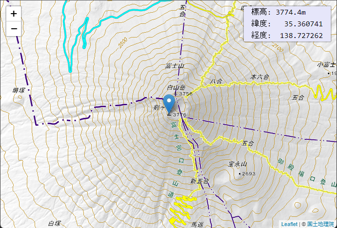

# React-Leafletで標高表示機能付きマップを作る

https://murasuke.github.io/leaflet-altitude-map/

## はじめに

地図を見ているとその場所の標高が知りたいと思うときがありませんか？

いつも使っている[GoogleMap](https://www.google.co.jp/maps/)では任意の場所の標高がわからず何とかしたいと思っていました。

まず地図を作ってみましたが([React Leaflet](https://react-leaflet.js.org/))が、標高はどうすれば良いのでしょうか？

調べてみると、国土地理院のサイトで[標高を求めるプログラム](https://maps.gsi.go.jp/development/elevation.html)が公開されています。JQueryを使っているため、そのままではReactで利用ができませんが、改修すれば何とかなりそうです。

という訳で[標高を求めるプログラム](https://maps.gsi.go.jp/development/elevation.html)を改修して、地図アプリに組み込んでみようと思います。


地図データは国土地理院のデータを利用しています。リアルタイムに地図を表示するプログラムであれば、出展の明示のみで利用可能なようです。


[地図の利用手続パンフレット](https://www.gsi.go.jp/common/000223838.pdf)より抜粋
```
●国土地理院サーバー上の地理院タイルをリアルタイムで読み込み表示するウェブサイト等を作成する場合、
申請は必要ですか？
➡ リアルタイムでの読込みは、出典の明示のみで申請不要です。出典は、「国土地理院」、「地理院タイル」等と記載してい
ただき、地理院タイル一覧ページ（https://maps.gsi.go.jp/development/ichiran.html）へのリンクを付けてください。
```

一度に実装するのは大変なので４段階に分けて実装しようと思います

  * ①最低限の地図アプリを作成する
  * ②クリックした場所の標高を表示する機能を追加する
  * ③現在位置を地図の初期表示位置にする
  * ④GPSボタンを追加して現在位置に戻せるようにする


---
### 国土地理院の解説ページ

* [標高を求めるプログラム](https://maps.gsi.go.jp/development/elevation.html)
* [標高タイルの詳細仕様](https://maps.gsi.go.jp/development/demtile.html)

### 標高の求め方について

  * 入力した経緯度値から、その場所に該当する「標高タイル」（PNG形式）をクライアントにダウンロード
  * 入力した経緯度値に該当する「標高タイル」のピクセルの画素値（RGB値）から、標高値が算出する

    ※ 詳細は元のソースでご確認ください。
---

## 前提

* Reactの基本的な機能を理解していること


## React-Leaflet のインストール
```
$ npx create-react-app leaflet-altitude-map --template typescript --use-npm
$ cd leaflet-altitude-map
$ npm i leaflet react-leaflet
$ npm i -D @types/leaflet
```


## ①最低限の地図アプリを作成する

* 地図とマーカーを表示します
* ドラッグ＆ドロップによる移動や、マウスホイールによる拡大縮小もできます


### ①-1位置を表すアイコン(Marker)の読み込み

React-leafletの不具合？でアイコンが読み込まれないため、最初にアイコンを読み込む処理を作ります。

src/utils/initLeaflet.ts

```tsx
import Leaflet from 'leaflet';
import icon from 'leaflet/dist/images/marker-icon.png';
import iconShadow from 'leaflet/dist/images/marker-shadow.png';

// marker setting
let DefaultIcon = Leaflet.icon({
  iconUrl: icon,
  shadowUrl: iconShadow,
  iconAnchor: [12, 41], // アイコンのとがった位置をクリックした場所に合わせるためのオフセット
});
Leaflet.Marker.prototype.options.icon = DefaultIcon;

```

### ①-2マップ表示機能ソース

* [react-leaflet](https://react-leaflet.js.org/)で地図を表示します
* `leaflet/dist/leaflet.css`を読み込みます(忘れると表示が崩れます)
* `①-1`で作成したソースを読み込み、位置表示アイコンをロードします
* 国土地理院の地図タイルを`<TileLayer>`で読み込みます
* 位置表示アイコンを`<Marker>`で表示します


App.tsx

```tsx
import React, { VFC } from 'react';
import { MapContainer, TileLayer, Marker, Popup } from 'react-leaflet';
import { LatLng } from 'leaflet';
import 'utils/initLeaflet';
import 'leaflet/dist/leaflet.css';
import './App.css';

const App: VFC = () => {
  const position = new LatLng(35.3607411, 138.727262);  // 富士山頂

  return (
    <div className="App">
      <MapContainer center={position} zoom={13}>
        <TileLayer
          attribution='&copy; <a href="https://maps.gsi.go.jp/development/ichiran.html">国土地理院</a>'
          url="https://cyberjapandata.gsi.go.jp/xyz/std/{z}/{x}/{y}.png"
        />
        <Marker position={position}>
          <Popup>
            A pretty CSS3 popup. <br /> Easily customizable.
          </Popup>
        </Marker>
      </MapContainer>
    </div>
  );
};

export default App;
```

### ①-3マップを全画面表示するためにCSSを変更

App.css

```css
/* 地図を画面全体に表示 */
.leaflet-container {
  width: 100vw;
  height: 100vh;
}

/* カーソルを標準に戻す(標準の手アイコンは位置を正確に選択しづらい) */
.leaflet-grab {cursor: auto;}
```

### ①-4ブラウザで表示して動作を確認

```bash
npm run start
```
---

## ②クリックした場所の標高を表示する機能を追加する

* クリックした場所の標高と位置を表示します



### ②-1位置から標高を取得する機能を追加

[標高を求めるプログラム](https://maps.gsi.go.jp/development/elevation.html)をこのプログラム用に移植したものです。

* exportメソッド
  * `getAltitude(lat, lng, callback)` ：標高をcallback関数で受け取る
    * 第1引数：標高
    * 第2引数：経度、緯度も含む

使い方

```typescript
  import { getAltitude } from './utils/altitude';

  // 標高を取得
  getAltitude(lat, lng, (alt, altDetail) => {
    console.log(`標高:${alt}m`);
    console.log(`緯度:${altDetail?.pos.lat} 経度:${altDetail?.pos.lng}`)
  });
```

src/utils/altitude.ts

```tsx
import Leaflet from "leaflet";

type LeafletClass = (new (...args: any[]) => any) & typeof Leaflet.Class;

type UrlInfo = {
  title: string;
  url: string;
  minzoom: number;
  maxzoom: number;
  fixed: number;
};

export type Position = {
  lat: number;
  lng: number;
  zoom: number;
};

export type AltitudeDetail = {
  fixed: number;
  h: number;
  pos: Position;
  title: string;
  type: string;
};

type altitudeCallback = (height?: string, detail?: AltitudeDetail) => void;

type funcRefresh = (
  lat: number,
  lon: number,
  initialz: number,
  callback?: altitudeCallback
) => void;

type GSIType = {
  Footer: LeafletClass;
  ElevationLoader: LeafletClass;
  content?: LeafletClass & { execRefresh: funcRefresh };
};

/**
 * 位置から標高を求める
 * https://maps.gsi.go.jp/development/elevation.html
 * ・国土地理院の「標高を求めるプログラム(https://maps.gsi.go.jp/development/elevation.html)」を参考にしました
 * ・関数「getAltitude()」で指定した位置の標高をcallback関数で返します。
 * ■概略(国土地理院のサンプル解説から引用)
 * 　・入力した経緯度値から、その場所に該当する「標高タイル」（PNG形式）をクライアントにダウンロードしてきます。
 * 　・入力した経緯度値に該当する「標高タイル」のピクセルの画素値（RGB値）から、標高値が算出されます。
 * 　・「標高タイル」には、「DEM5A」、「DEM5B」、「DEM5C」、「DEM10B」、「DEMGM」の4種類があります（本サンプルプログラムでは「DEMGM」は使用していません）。
 * 　・標高タイルの精度は、「DEM5A」＞「DEM5B」＞「DEM5C」＞「DEM10B」＞「DEMGM」の順に高精度になります。
 * 　・「DEM5A」、「DEM5B」及び「DEM5C」は、日本全国の範囲でデータが整備されていません。
 * 　・そのため、本プログラムでは、まず「DEM5A」のデータを探して、なければ「DEM5B」、「DEM5B」もなければ「DEM5C」、最後に「DEM10B」を使用するという処理をしています。
 * 　・また、海部などデータが存在しないところのピクセル値は、(R,G,B)=(128,0,0)となっています。
 * 　・標高タイルの詳細仕様はこちらを参照してください。

 *
 */
const GSI: GSIType = {
  Footer: Leaflet.Class.extend({
    initialize() {},
    destroy() {},

    clear() {
      if (this._elevationLoader) {
        this._elevationLoader.cancel();
      }
    },

    execRefresh(
      lon: number,
      lat: number,
      zoom: number,
      callback?: altitudeCallback
    ) {
      if (!this._elevationLoader) {
        this._elevationLoader = new GSI.ElevationLoader();
        this._elevationLoader.on(
          "load",
          Leaflet.bind((e) => {
            if (callback)
              if (e.h === undefined) {
                callback(undefined, e);
              } else {
                const height = e.h.toFixed(e.fixed !== undefined ? e.fixed : 0);
                callback(height, e);
              }
          }, this)
        );
      }

      this._elevationLoader.load({
        lat: lat,
        lng: lon,
        zoom: zoom,
      });
    },
  }),

  ElevationLoader: Leaflet.Evented.extend({
    _demUrlList: [
      {
        title: "DEM5A",
        url: "https://cyberjapandata.gsi.go.jp/xyz/dem5a_png/{z}/{x}/{y}.png",
        minzoom: 15,
        maxzoom: 15,
        fixed: 1,
      },
      {
        title: "DEM5B",
        url: "https://cyberjapandata.gsi.go.jp/xyz/dem5b_png/{z}/{x}/{y}.png",
        minzoom: 15,
        maxzoom: 15,
        fixed: 1,
      },
      {
        title: "DEM5C",
        url: "https://cyberjapandata.gsi.go.jp/xyz/dem5c_png/{z}/{x}/{y}.png",
        minzoom: 15,
        maxzoom: 15,
        fixed: 1,
      },
      {
        title: "DEM10B",
        url: "https://cyberjapandata.gsi.go.jp/xyz/dem_png/{z}/{x}/{y}.png",
        minzoom: 14,
        maxzoom: 14,
        fixed: 0,
      },
    ],
    pow2_8: Math.pow(2, 8),
    pow2_16: Math.pow(2, 16),
    pow2_23: Math.pow(2, 23),
    pow2_24: Math.pow(2, 24),

    initialize(map: any, options: any) {
      this._map = map;
    },

    load(pos: Position) {
      this._destroyImage();

      this._current = {
        pos: pos,
        urlList: this._makeUrlList(pos),
      };

      this._load(this._current);
    },

    _makeUrlList(pos: Position) {
      const list = [];
      for (var i = 0; i < this._demUrlList.length; i++) {
        const demUrl = this._demUrlList[i];

        if (demUrl.maxzoom < demUrl.minzoom) {
          const buff = demUrl.maxzoom;
          demUrl.maxzoom = demUrl.minzoom;
          demUrl.minzoom = buff;
        }

        const minzoom = demUrl.minzoom;

        for (var z = demUrl.maxzoom; z >= minzoom; z--) {
          list.push({
            title: demUrl.title,
            zoom: z,
            url: demUrl.url,
            fixed: demUrl.fixed,
          });
        }
      }
      return list;
    },

    _destroyImage() {
      if (this._img) {
        this._img.removeEventListener("load", this._imgLoadHandler);
        this._img.removeEventListener("error", this._imgLoadErrorHandler);

        this._imgLoadHandler = null;
        this._imgLoadErrorHandler = null;

        delete this._img;
        this._img = null;
      }
    },

    cancel() {
      this._destroyImage();
    },

    _load(current: any) {
      this._destroyImage();

      if (this._current !== current) return;

      if (!this._current.urlList || this._current.urlList.length <= 0) {
        // not found
        this.fire("load", {
          h: undefined,
          pos: current.pos,
        });
        return;
      }

      const url = this._current.urlList.shift();

      const tileInfo = this._getTileInfo(
        this._current.pos.lat,
        this._current.pos.lng,
        url.zoom
      );
      this._img = document.createElement("img");
      this._img.setAttribute("crossorigin", "anonymous");

      this._imgLoadHandler = Leaflet.bind(
        this._onImgLoad,
        this,
        url,
        current,
        tileInfo,
        this._img
      );
      this._imgLoadErrorHandler = Leaflet.bind(
        this._onImgLoadError,
        this,
        url,
        current,
        tileInfo,
        this._img
      );

      this._img.addEventListener("load", this._imgLoadHandler);
      this._img.addEventListener("error", this._imgLoadErrorHandler);

      const makeUrl = (url: any, tileInfo: any) => {
        var result = url.url.replace("{x}", tileInfo.x);
        result = result.replace("{y}", tileInfo.y);
        result = result.replace("{z}", url.zoom);
        return result;
      };

      this._img.src = makeUrl(url, tileInfo);
    },

    _onImgLoad(url: UrlInfo, current: any, tileInfo: any, img: any) {
      if (current !== this._current) return;

      if (!this._canvas) {
        this._canvas = document.createElement("canvas");
        this._canvas.width = 256;
        this._canvas.height = 256;
      }

      var ctx = this._canvas.getContext("2d");
      ctx.drawImage(img, 0, 0);

      const imgData = ctx.getImageData(0, 0, 256, 256);
      const idx = tileInfo.pY * 256 * 4 + tileInfo.pX * 4;
      const r = imgData.data[idx + 0];
      const g = imgData.data[idx + 1];
      const b = imgData.data[idx + 2];
      var h = 0;

      if (r !== 128 || g !== 0 || b !== 0) {
        const d = r * this.pow2_16 + g * this.pow2_8 + b;
        h = d < this.pow2_23 ? d : d - this.pow2_24;
        if (h === -this.pow2_23) h = 0;
        else h *= 0.01;
        this._destroyImage();

        this.fire("load", {
          h: h,
          title: url.title,
          fixed: url.fixed,
          pos: current.pos,
        });
      } else {
        this._onImgLoadError(url, current, tileInfo, img);
      }
    },

    _onImgLoadError(url: UrlInfo, current: any, tileInfo: any, img: any) {
      if (current !== this._current) return;
      this._load(current);
    },

    _getTileInfo(lat: number, lng: number, z: number) {
      const lng_rad = (lng * Math.PI) / 180;
      const R = 128 / Math.PI;
      const worldCoordX = R * (lng_rad + Math.PI);
      const pixelCoordX = worldCoordX * Math.pow(2, z);
      const tileCoordX = Math.floor(pixelCoordX / 256);

      const lat_rad = (lat * Math.PI) / 180;
      const worldCoordY =
        (-R / 2) * Math.log((1 + Math.sin(lat_rad)) / (1 - Math.sin(lat_rad))) +
        128;
      const pixelCoordY = worldCoordY * Math.pow(2, z);
      const tileCoordY = Math.floor(pixelCoordY / 256);

      return {
        x: tileCoordX,
        y: tileCoordY,
        pX: Math.floor(pixelCoordX - tileCoordX * 256),
        pY: Math.floor(pixelCoordY - tileCoordY * 256),
      };
    },
  }),
};

GSI.content = new GSI.Footer();

/**
 * 位置から標高を求める関数
 * @param lat
 * @param lon
 * @param callback
 */
export const getAltitude = (
  lat: number,
  lon: number,
  callback?: altitudeCallback
) => {
  const initialz = 14;
  GSI.content?.execRefresh(lon, lat, initialz, callback);
};
```


### ②-2情報表示エリア

 * クリックした位置の「標高」「緯度」「経度」を表示するエリア
 * 右上に表示
 * propsで受け取った値を表示する

画面の四隅にアイコンや表示領域を配置するために(@skyeer/react-leaflet-custom-control)[https://www.npmjs.com/package/@skyeer/react-leaflet-custom-control]を利用します。


* インストール
```bash
npm install @skyeer/react-leaflet-custom-control
```

* 使い方
  * positionで表示位置を指定。Control内部は任意に表示内容を記載します。


src/AltitudeArea.tsx

```tsx
import { VFC } from 'react';
import Control from 'react-leaflet-custom-control';
import { AltitudeDetail } from './utils/altitude';

/**
 * 情報表示エリア
 * ・クリックした位置の「標高」「緯度」「経度」を表示するエリア
 * ・propsで受け取った値を表示する
 */
const AltitudeArea: VFC<{ altitude?: AltitudeDetail }> = ({ altitude }) => {
  const f = (num: number, fixed = 7) =>
    ('             ' + num.toFixed(fixed)).slice(-6 - fixed);
  const formatAlt = (alt: AltitudeDetail) =>
    `標高:${f(alt.h ?? 0, alt.fixed)}m\n緯度:${f(alt.pos.lat)}\n経度:${f(
      alt.pos.lng,
    )}`;

  return (
    <Control position="topright">
      <div style={{ width: '200px', backgroundColor: 'Lavender' }}>
        <pre className="coords">{altitude ? formatAlt(altitude) : ''}</pre>
      </div>
    </Control>
  );
};

export default AltitudeArea;
```

### ②-3位置表示アイコン
 * クリックした位置にアイコン表示する
 * 位置(経度、緯度)を元に標高を取得し、情報表示エリアを更新する(state経由)

src/LocationMarker.tsx

 ```tsx
import { VFC, useState } from "react";
import { LatLng } from "leaflet";
import { Marker, Popup, useMapEvents } from "react-leaflet";
import { getAltitude, AltitudeDetail } from "./utils/altitude";

type propType = {
  altitude?: AltitudeDetail;
  setAltitude: React.Dispatch<React.SetStateAction<AltitudeDetail | undefined>>;
};

/**
 * 位置表示アイコン
 * ・クリックした位置にアイコン表示する
 * ・位置から標高を取得し、情報表示エリアに引き渡す(state経由)
 */
const LocationMarker: VFC<propType> = ({ setAltitude, altitude }) => {
  const [position, setPosition] = useState<LatLng | null>(null);
  useMapEvents({
    click(e) {
      setPosition(e.latlng);
      const { lat, lng } = e.latlng;
      // 標高を取得
      getAltitude(lat, lng, (alt, altDetail) => {
        console.log(alt + "m");
        setAltitude(altDetail);
      });
    },
  });

  return position === null ? null : (
    <Marker position={position}>
      <Popup>{`Alt(${(altitude?.h ?? 0).toFixed(1) + "m"}) ${position}`}</Popup>
    </Marker>
  );
};

export default LocationMarker;
 ```

* 位置表示エリアの大きさ、フォント、マージンを調整するため下記を追加する

src/App.css

```css
/* 位置表示エリア */
.coords {
  font-family: Consolas, Monaco, 'Andale Mono', 'Ubuntu Mono', monospace;
  font-size: 16px;
  margin : 0.5em 1em;
  padding: 0;
}
```


### ②-4マップ表示機能ソースを修正(情報表示、位置表示を追加)
 * 上記で作成した「情報エリア」「位置表示アイコン」を表示する
 * 位置情報をstateで保持する。値を更新するためLocationMakerに更新メソッドを引き渡す

src/App.tsx

```tsx
import { VFC, useState } from "react";
import { MapContainer, TileLayer } from "react-leaflet";
import "./utils/initLeaflet";
import { AltitudeDetail } from "./utils/altitude";
import AltitudeArea from "./AltitudeArea";
import LocationMarker from "./LocationMarker";

import "leaflet/dist/leaflet.css";
import "./App.css";

/**
 * 地図表示
 * ・上記で作成した「情報エリア」「位置表示アイコン」を表示する
 * ・位置情報をstateで保持する。値を更新するためLocationMakerに更新メソッドを引き渡す
 */
const App: VFC = () => {
  const [altitude, setAltitude] = useState<AltitudeDetail>();

  return (
    <MapContainer center={{ lat: 35.3607411, lng: 138.727262 }} zoom={13}>
      <TileLayer
        attribution='&copy; <a href="https://maps.gsi.go.jp/development/ichiran.html">国土地理院</a>'
        url="https://cyberjapandata.gsi.go.jp/xyz/std/{z}/{x}/{y}.png"
      />
      <AltitudeArea altitude={altitude} />
      <LocationMarker altitude={altitude} setAltitude={setAltitude} />
    </MapContainer>
  );
};
export default App;
 ```
### ②-5ブラウザで表示して動作を確認

```bash
npm run start
```

クリックした位置にマーカーが表示されるのと同時に、位置情報が更新されます。


---

## ③現在位置を地図の初期表示位置にする

* navigator.geolocation.getCurrentPosition()で現在位置を取得して表示

```tsx
import { VFC, useState, useEffect } from "react";
import { MapContainer, TileLayer } from "react-leaflet";
import "./utils/initLeaflet";
import { AltitudeDetail } from "./utils/altitude";
import AltitudeArea from "./AltitudeArea";
import LocationMarker from "./LocationMarker";

import "leaflet/dist/leaflet.css";
import "./App.css";

/**
 * 地図表示
 * ・上記で作成した「情報エリア」「位置表示アイコン」を表示する
 * ・位置情報をstateで保持する。値を更新するためLocationMakerに更新メソッドを引き渡す
 */
const App: VFC = () => {
  const [altitude, setAltitude] = useState<AltitudeDetail>();

  useEffect(() => {
    navigator.geolocation.getCurrentPosition((e) => {
      const position = new LatLng(e.coords.latitude, e.coords.longitude);
      setAltitude({
        fixed: 0,
        h: 0,
        pos: { ...position, zoom: 14 },
        title: '',
        type: '',
      });
    });
  }, []);

  if (!altitude) {
    return <></>;
  } else {
    return (
      <MapContainer center={altitude.pos} zoom={14}>
        <TileLayer
          attribution='&copy; <a href="https://maps.gsi.go.jp/development/ichiran.html">国土地理院</a>'
          url="https://cyberjapandata.gsi.go.jp/xyz/std/{z}/{x}/{y}.png"
        />
        <AltitudeArea altitude={altitude} />
        <LocationMarker altitude={altitude} setAltitude={setAltitude} />
      </MapContainer>
    );
  }
};
export default App;
 ```

## ④GPSボタンを追加して現在位置に戻せるようにする

